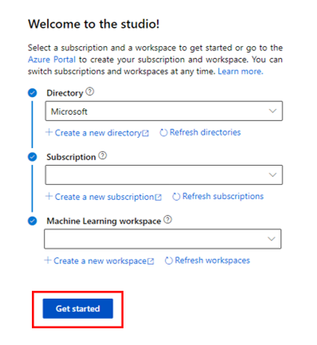
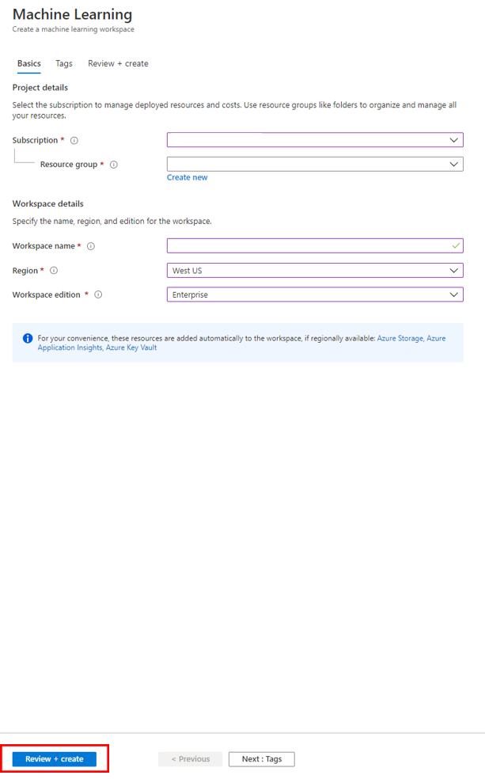
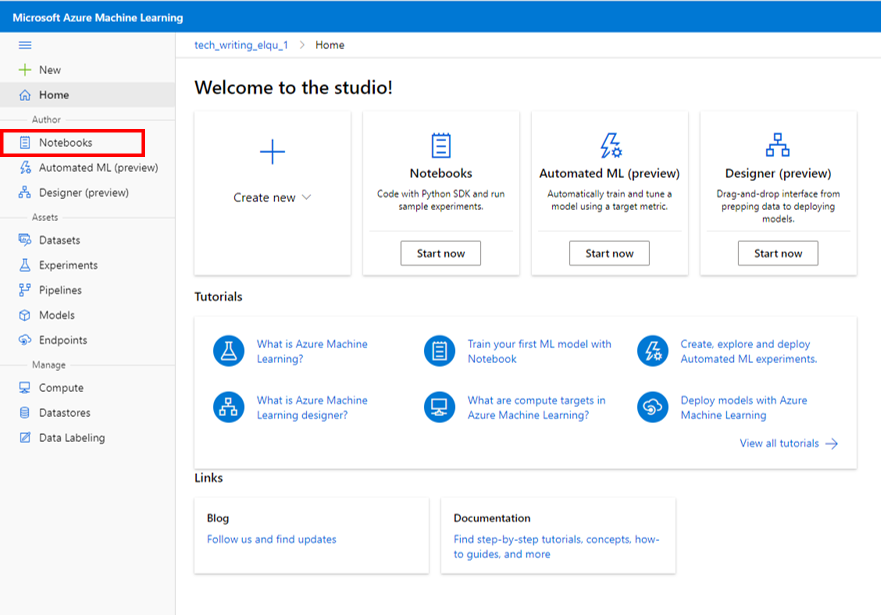
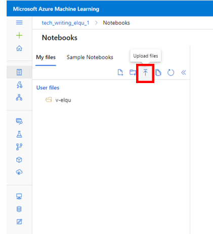
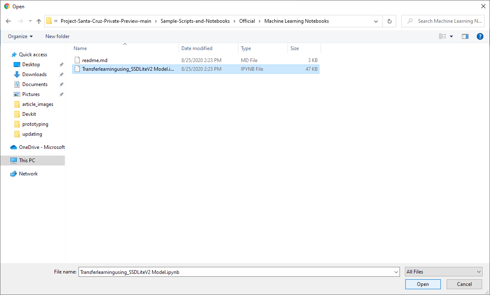
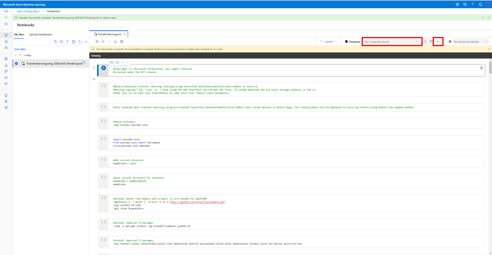
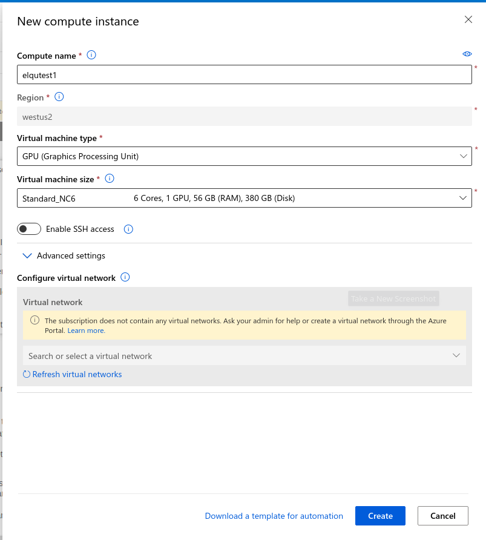

# Getting started with advanced development in the cloud via Jupyter Notebooks and Azure Machine Learning

**Please note!** The experiences in this repository should be considered to be in **preview/beta**.
Significant portions of these experiences are subject to change without warning. **No part of this code should be considered stable**.
Although this device is in public preview, if you are using these advanced experiences, we would like your feedback. If you have not
[registered for *private* preview](https://go.microsoft.com/fwlink/?linkid=2156349), please consider doing so before using this functionality
so that we can better track who is using it and how, and so that you can have a say in the changes we make to these experiences.

This article walks you through the process of setting up an Azure Machine Learning workspace, uploading a Jupyter Notebook to the workspace,
creating a compute instance, and running the cells of the notebook within the workspace.

The [notebook](transfer-learning-using-ssd.ipynb) performs transfer learning using a pre-trained TensorFlow model (MobileNet-SSD-V2-Lite) on AzureML
in Python with a custom dataset to detect bowls.

The notebook shows how to start from [COCO](https://cocodataset.org/#home), filter it down to only the class of interest (bowls), and then
convert it into the appropriate format. Alternatively, you could use the open-source [VoTT 2](https://github.com/microsoft/VoTT) labeling tool to create
and label bounding boxes in the PASCAL VOC format.

After retraining the model on the custom dataset, the model can then be deployed to your Percept DK using the module twin update method.
You may then check model inferencing by viewing the live RTSP stream from the Azure Eye SoM of your devkit. Both model retraining and deployment are
performed within the notebook in the cloud.

## Prerequisites

- [Azure Machine Learning Subscription](https://azure.microsoft.com/en-us/free/services/machine-learning/)
- Azure Percept Development Kit with Azure Eye SoM connected
- OOBE (out of box experience) completed

## Download the Repository

Clone this repository or download the ZIP file.

## Set up Azure Machine Learning Portal and Notebook

1. Go to the [Azure Machine Learning Portal](https://ml.azure.com).

1. Select your directory, Azure subscription, and Machine Learning workspace from the drop down menus and click **Get started**.

    

    If you don’t have an Azure Machine Learning workspace yet, click **Create a new workspace**. In the new browser tab, do the following:

    1. Select your Azure subscription.
    1. Select your resource group.
    1. Enter a name for your workspace.
    1. Select your region.
    1. Select your workspace edition.
    1. Click **Review and create**.
    1. On the next page, review your selections and click **Create**.

        

    Please allow a few minutes for workspace creation. After the workspace creation is complete, you will see green check marks next to
    your resources and **Your deployment is complete** at the top of the Machine Learning Services overview page.

    

    Once your workspace creation is complete, return to the machine learning portal tab and click **Get started**.

1. In the machine learning workspace homepage, click **Notebooks** on the left-hand pane.

    

1. Under the **My files** tab, click the vertical arrow to upload your .ipynb file.

    

1. Navigate to and select the [transfer-learning-using-ssd.ipynb file](transfer-learning-using-ssd.ipynb) from your local copy of the
   GitHub repository. Click **Open**. In the **Upload files** window, check the box next to **I trust contents from this file** and click **Upload**.

    

1. On the top right menu bar, check your **Compute** status. If no computes are found, click the **+** icon to create a new compute.

    

1. In the **New compute instance** window, enter a **Compute name**, choose a **Virtual machine type**, and select a **Virtual machine size**. Click **Create**.

    

    Once you click **Create**, your **Compute** status will display a blue circle and **\<your compute name> - Creating**

    

    Your **Compute** status will display a green circle and **\<your compute name> - Running** after compute creation is complete.

    

1. Once the compute is running, select the **Python 3.6 - AzureML** kernel from the drop-down menu next to the **+** icon.

## Working with the notebook

You are now ready to run the notebook to train your custom bowl detector and deploy it to your devkit. Make sure to run each cell of the notebook
individually as some of the cells require input parameters before executing the script. Cells that require input parameters may be
edited directly in the notebook. To run a cell, click the play icon on the left side of the cell:

## Provide Feedback

After completing the advanced tools experiences, please provide feedback
via this [questionnaire](https://forms.office.com/Pages/ResponsePage.aspx?id=v4j5cvGGr0GRqy180BHbRzoJxrXKT0dEvfQyxsA0h8lUMzE0V0pCTFU4UUVSS0xTRUtNT0hZSEs1Ry4u).
Your feedback will help us continue to fine-tune and improve the advanced tools experience.

For additional Azure Machine Learning service example notebooks, please visit this [repo](https://github.com/Azure/MachineLearningNotebooks/tree/2aa7c53b0ce84e67565d77e484987714fdaed36e/how-to-use-azureml)
