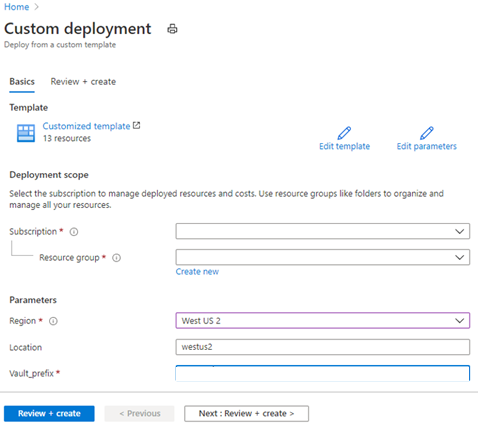
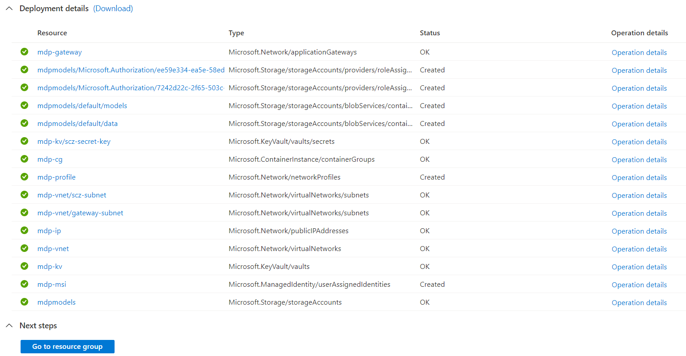

# Provision a new locker


- **Please note!** Azure Percept currently supports AI model protection as a private preview feature.  
- Portions of this code base are subject to change without notice.

Please consider taking our [Product survey](https://go.microsoft.com/fwlink/?linkid=2156573) to help us improve Azure Percept Model and Data Protection features based on your IoT Edge background and goals.

Azure Percept MM relies on a number of Azure resources to operate (please see [topology](server-topology.md) for more details). To provision an instance on Azure, follow the steps outlined below.  

## Step 1. Provision Azure Percept AI/ML model and sensor data protection solution

1. Press this button to deploy Azure Percept MM solution to your Azure public cloud:

    [](https://portal.azure.com/#create/Microsoft.Template/uri/https%3A%2F%2Fraw.githubusercontent.com%2Fmicrosoft%2Fazure-percept-advanced-development%2Fmain%2Fsecured_locker%2Fdeployment%2Fazuredeploy.json)

    The button will redirect you to the **Custom deployment** page in the Azure portal:

    

2. To deploy the solution in the cloud, enter the following parameters and click **Review + create**:

    - <strong>Subscription</strong>: the subscription in which to create the solution.

    - <strong>Resource Group</strong>: unique name of a new resource group to host the Azure Percept MM solution components.

    - <strong>Region</strong>: Azure region in which the solution will be deployed.

    - <strong>Location</strong>: location within the region.

    - <strong>Vault_prefix</strong>: prefix to attach to new resource names.

3. On the next page, click <strong>Create</strong> after agreeing to the terms and conditions.

    

    The deployment may take several minutes to complete and should result in creation of Azure resources within the specified resource group.

    

## Step 2: Update deployment using PowerShell script

### Prerequisites

We offer a PowerShell script for service deployment. To run the script, you must install the following:

- [Git Bash](https://git-scm.com/downloads)
- [PowerShell](https://docs.microsoft.com/en-us/powershell/scripting/install/installing-powershell?view=powershell-7)
- [Azure PowerShell Module](https://docs.microsoft.com/en-us/powershell/azure/install-az-ps?view=azps-4.6.1)

### Update service access

1. Open Git Bash and enter the following to clone the Project Azure Percept GitHub repository:

    ```
   git clone https://github.com/microsoft/azure-percept-advanced-development.git
   ```

1. Launch PowerShell.

1. Run the device_identity script in the PowerShell terminal:

   ```
   cd azure-percept-advanced-development/secured_locker/deployment
   ./device_identity.ps1 -vaultName <Azure Key Vault instance name generated by provision step> -subscription <Azure subscription name or id>
   ```
    
    > **NOTE**: your Key Vault instance will be [Locker_prefix]-kv, where [Locker_prefix] is the prefix parameter chosen during the custom deployment creation above.

   For example, the following command generates a new service principal and grants it access to the ```test-mm-kv``` key vault instance under the ```my-subscription``` subscription:

   ```
    ./device_identity.ps1 -vaultName test-mm-kv -subscription my-subscription
    ```

2. The script will open a web browser. Enter your Azure account login details when prompted.

3. Once the script finishes, it will output the service principal that has been granted access to the Azure Key Vault service:

   ```
   Azure Percept model management service is provisioned at:  ...
   Service Principal Client ID:     3f38...
   Service Principal Tenant ID:     72f9...
   Service Principal Client Secret: bf49...
   ```

    > **NOTE**: Write down the service principal credentials (Client ID, Tenant ID, Client Secret). You'll use it to log in to the Azure Percept service later.

## Step 3: Add TLS certificate to gateway

Azure Percept MM is deployed with an [Azure Application Gateway](https://docs.microsoft.com/en-us/azure/application-gateway/overview) as its entry point. By default, the gateway is configured to serve an HTTP endpoint only. As we may need to pass the decryption key to the client-side containers, you should enable HTTPS on the Application Gateway instance with a proper certificate that has the subject matching with the gateway’s FQDN.

The Azure Percept MM solution offers a ```config_certificate.ps1``` PowerShell script to assist you with configuring the certificate. If you don't have a certificate, the script generates a self-signed certificate (for testing purposes only). You'll need ```openssl``` to generate the certificate.

>**NOTE**: A way to get ```openssl``` on Windows 10 is to install [Git Bash](https://git-scm.com/downloads), which comes with ```openssl``` under folder ```c:\Program Files\Git\usr\bin```. The script assumes you've added openssl to your PATH variable.

1. Launch PowerShell as an Administrator.

> **NOTE**: Administrative privileges are required when creating self-signed certificate.

1. Run the config_certificate script:

   ```
   ./config_certificate.ps1 -subscription <Azure subscription name or id> -prefix <resource prefix used in provision step> -resourceGroup <resource group of your deployment> -location <location of your deployment>
   ```

   >**NOTE**: Make sure ```location```, ```resourceGroup```, ```subscription``` and ```prefix``` match the parameters selected earlier when creating your custom deployment.

   For example, the following command updates your locker deployment with a self-signed certificate.

   ```
   ./config_certificate.ps1 -subscription my-subscription -prefix test-mm  -resourceGroup my-rg -location westus2
   ```

   To use your own certificate, run the script with a ```certFile``` parameter pointing to your ```.pfx``` file and ```certPassword``` parameter with your private key password. For example:

   ```
   ./config_certificate.ps1 -subscription my-subscription -prefix test-mm  -resourceGroup my-rg -location westus2 -certFile .\appgwcert.pfx -certPassword abc
   ```

1. When prompted (only when you use auto-generated certificate), enter a password for your certificate private key.

1. Once the script finishes, your Application Gateway will be configured to use HTTPS (via port 443) instead of HTTP (via port 5000).

   > **NOTE**: Write down the service URL. You'll use it to access the service later.

## Step 4: Install Python SDK
If [Python](https://www.python.org/) is not already installed, then use the Dev Tools Pack Installer to configure the tools required to protect AI/Ml models and training data. Please note that the Dev Tools Pack Installer will reinstall any existing packages so that your tools are consistent with the Installer software versions.
[Dev Tools Pack Installer Instructions](https://go.microsoft.com/fwlink/?linkid=2156431)

1. Launch PowerShell.
2. Install Azure Percept SDK in the PowerShell terminal:
   ```
   pip install sczpy
   ```

## Step 5: Clean up resources

Other Azure Percept MM features build upon this quickstart. If you plan to continue with subsequent quickstarts and tutorials, you may wish to leave these resources in place.

When you are ready to clean up resources, please ensure you have decrypted any encrypted data and AI/ML models prior to deletion. Afterward, delete the resource group, which deletes the Azure Percept MM solution components.
